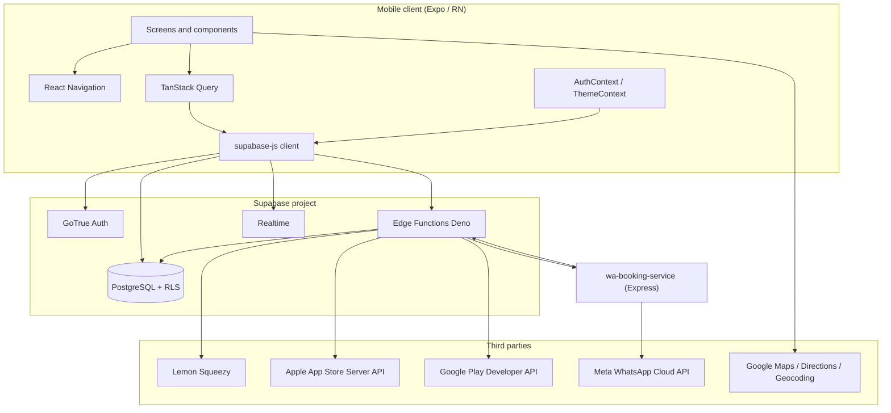

# Pixap

Pixap is an **Expo (SDK 54) / React Native** mobile client for a local-services marketplace: discover **business cards** (venues), browse **categories** and **shopping items**, manage **cart** and **bookings**, use **PixAI**-assisted discovery and slot hints, optional **WhatsApp-mediated venue confirmation** for service bookings, **Lemon Squeezy** webhooks for some payment flows, and **native in-app purchase** subscriptions (Apple / Google) verified via Supabase Edge Functions.

Backend data and auth live in **Supabase** (PostgreSQL, Auth, Realtime, Storage). Additional **Supabase Edge Functions** (Deno) implement orchestration, payments, IAP verification, and WhatsApp booking glue. A separate **Node (Express) `wa-booking-service`** talks to the **Meta WhatsApp Cloud API** and calls back into Supabase when a cart row uses the WhatsApp confirmation pipeline.

---

## Table of contents

1. [High-level architecture](#high-level-architecture)
2. [Repository layout](#repository-layout)
3. [Mobile app layers](#mobile-app-layers)
4. [Supabase data and auth](#supabase-data-and-auth)
5. [Business domains and flows](#business-domains-and-flows)
6. [Layer interactions](#layer-interactions)
7. [API reference](#api-reference)
8. [Configuration and environment](#configuration-and-environment)
9. [Local development](#local-development)
10. [Further reading](#further-reading)

---

## High-level architecture



- **Client**: Mostly talks to Supabase with the **anon key** and the users **JWT** after sign-in. Some server-side payment integrations can use a **reverse proxy** (`EXPO_PUBLIC_PIXAPP_API_URL`) for stable HTTPS paths (e.g. Lemon).
- **Edge Functions**: Server-side logic with **service role** where needed; several functions have **`verify_jwt = false`** in `supabase/config.toml` because the gateway JWT check is incompatible with server-to-server callsthose functions enforce auth or secrets **inside** the handler.
- **`wa-booking-service`**: Holds an in-memory **booking state machine**, sends WhatsApp templates/messages, and **POSTs** updates to `n8n-wa-booking-callback` using the Supabase anon JWT plus optional `x-wa-booking-secret`.

---

## Repository layout

| Path | Role |
|------|------|
| `App.tsx` | Root: gesture handler, safe area, theme, React Query, auth, splash, permissions gate, navigation. |
| `app.config.ts` | Expo config: app id, scheme `pixap`, iOS/Android, `extra` env passthrough, Google Maps keys, associated domains. |
| `src/pages/` | Route-level UI (FSD pages): home, place detail, booking, cart, stories, profile, auth, paywall, etc. |
| `src/navigation/` | Tab + stack navigators, deep linking config, route types. |
| `src/contexts/` | `AuthContext`, `ThemeContext`. |
| `src/hooks/` | TanStack Query hooks: business cards, cart, bookings, stories, PixAI, slots, subscription, etc. |
| `src/integrations/supabase/` | Typed `supabase` client and generated `Database` types. |
| `src/lib/` | Env resolution, OAuth helpers, maps/directions, permissions storage, etc. |
| `src/services/` | Cross-cutting services (e.g. push / IAP wiring). |
| `supabase/migrations/` | SQL schema and RLS evolution. |
| `supabase/functions/` | Deno Edge Functions (see [API reference](#api-reference)). |
| `supabase/proxy/api.pixapp.kz.nginx.conf.example` | Example nginx routes for Lemon (and pattern for other paths). |
| `backend/wa-booking-service/` | Standalone Express WhatsApp booking service ([local README](backend/wa-booking-service/README.md)). |

---

## Mobile app layers

### Presentation

- **Screens** compose UI and call hooks; there is no separate MVVM layer**hooks + React Query** own async state.
- **Components** (`src/components/`) provide reusable UI (maps modals, story UI, booking panels, shimmer skeletons).

### Navigation

- **`AppNavigator.tsx`**: Bottom tabs **Home**, **Feed**, **Bookings**, **Cart**, **Profile**. Each tab is a **native stack** with shared screen names (place detail, booking flow, story viewer/composer, paywall, etc.).
- **`linking.ts` / `lib/linking.ts`**: Universal / custom scheme links; special handling for `payment-success` and `payment-canceled` to open the cart stack with the right screen.

### Application state

- **`AuthContext`**: Wraps `supabase.auth` session lifecycle, sign-up/in/out, password reset redirects, and registers push tokens when `user.id` is present.
- **`ThemeContext`**: Light/dark palette and navigation theme bridge.

### Data access

- **Direct PostgREST** via `supabase.from(...)` in hooks for tables the user is allowed to read/write under RLS (e.g. `business_cards`, `cart_items`, `bookings`, stories).
- **Edge Functions** via `supabase.functions.invoke("<name>", { body, headers })` for privileged or multi-step operations (PixAI orchestration, slot computation, WhatsApp start, confirm booking, IAP).

### Cross-cutting

- **`expo-constants`** + `app.config.ts` **`extra`** expose `EXPO_PUBLIC_*` at runtime (`src/lib/env.ts`).
- **Google Maps**: Native maps + REST Directions/Geocoding; listings store **address text** (not lat/lng)the app geocodes for pins and routes.

---

## Supabase data and auth

### Auth

- Email/password and OAuth (Google / Apple) go through **Supabase Auth**; the client uses **AsyncStorage** for session persistence.
- Mobile OAuth return URLs use the app **scheme** (see `getOAuthRedirectUri` / OAuth callback screen); hosted **HTTPS** base is used for email confirmation and password reset links (`EXPO_PUBLIC_OAUTH_REDIRECT_BASE`).

### Notable tables (from migrations; names are indicative)

- **`business_cards`**: Venues/services: name, address, city, rating, booking fields, images, `contact_whatsapp`, tags, category, etc.
- **`cart_items`**: Service booking drafts in the users cart; status `created` | `paid` | `expired`; columns for **WhatsApp flow** (`wa_n8n_*`, `wa_status_lines`, `wa_confirmable`, `wa_confirmed_price`, `wa_payment_link`, &).
- **`bookings`**: Confirmed reservations; `payment_status` reflects paid vs pending (venue links, Lemon, free flows, etc.).
- **`shopping_*`**: Shopping cart line items and catalog items (Lemon / external checkout where used).
- **`stories`**, **`story_comments`**, **`story_reactions`**, **`user_follows`**: Social stories feed.
- **`subscription_entitlements`**, **`subscription_transactions`**, **`subscription_receipts`**, **`subscription_events`**: IAP subscription state and audit trail.
- **`processed_lemon_orders`**: Idempotency for Lemon webhooks.

Exact columns and RLS live in `supabase/migrations/`; regenerate client types when schema changes.

### Realtime

- Example: `useCartItems` subscribes to **`postgres_changes`** on `cart_items` for the signed-in user so WhatsApp callback updates refresh the UI without manual polling (polling is still used as a fallback while a WA flow is in progress).

---

## Business domains and flows

### 1. Discovery and place detail

- Users browse **home / category / search** data from `business_cards` (and related hooks).
- **Place detail** supports directions via **Geocoding + Directions API** from the users location.

### 2. Manual booking flow

- User picks slot/cost and customer details � **`cart_items`** row (`status: "created"`) via `useCreateCartItem` or related flows.
- Optional **WhatsApp venue confirmation**: client invokes **`n8n-wa-booking-start`** with `cart_item_id`. That Edge Function loads the row (with venue `contact_whatsapp`), ensures a **`wa_n8n_callback_token`**, and **POSTs** a payload to **`wa-booking-service` `POST /webhook/booking`**, which starts the **availability � pricing � payment link / free** state machine and notifies **`n8n-wa-booking-callback`** to patch the same `cart_items` row.
- When `wa_confirmable` is true, the user calls **`confirm-service-cart-booking`** with `action: "confirm"` (free) or `"pay"` (priced path inserts `bookings` with `payment_status: "pending"` until settled elsewhere).

### 3. PixAI-assisted booking

- **`pixai-orchestrate`** (authenticated): given a **flow** (city, mode `nearby` | `city`, category, restaurant-table flag, optional GPS), searches places via RPCs **`search_business_cards_nearby`** / **`search_business_cards_in_city`** with PostgREST fallback; returns **assistant text**, **places**, and **demo slot suggestions** (the edge function currently returns illustrative slot rows; the app can also use **`get-available-slots`** for real busy/free logic from `bookings`).
- Client-side **`usePixAI`** refreshes the session before invoke to avoid **401 Invalid JWT** on the Functions gateway.

### 4. Shopping cart

- Users manage **shopping** lines in-app; fulfillment and payment are coordinated via **WhatsApp** (availability CTA from cart) and/or **Lemon** checkout on the server side where configured — there is no in-app card processor for goods.

### 5. Lemon Squeezy

- **`lemon-create-checkout`**: Authenticated checkout session creation against Lemons API (store/variant env).
- **`lemon-webhook`**: **No JWT**; validates **`X-Signature`** with `LEMONSQUEEZY_SIGNING_SECRET`, handles `order_created` for `checkout_type` **`shopping_cart`** or **`service_booking`**, marks carts paid and creates bookings as appropriate.

### 6. Subscriptions (IAP)

- **`iap-verify-purchase`**: Client sends purchase payload; function talks to **Apple** / **Google** APIs using configured secrets and upserts **`subscription_entitlements`** (and related rows).
- **`iap-sync-status`**: Lightweight entitlement read + expiry cleanup for the current user.
- **`iap-apple-notifications`** / **`iap-google-rtdn`**: Server-to-server subscription lifecycle events (JWT verify off; secured by Apple/Google payload verification patterns inside).

---

## Layer interactions

### Typical authenticated read/write

1. User signs in � **GoTrue** returns JWT � `supabase-js` attaches it to PostgREST and (when not overridden) to **`functions.invoke`**.
2. Hook runs `queryFn` � `supabase.from("...").select(...)` � **RLS** allows or denies rows.
3. Optional **Realtime** channel invalidates React Query caches on `UPDATE`.

### WhatsApp booking chain

1. Mobile: `supabase.functions.invoke("n8n-wa-booking-start", { body: { cart_item_id } })`.
2. Edge: validates user, loads `cart_items` + `business_cards.contact_whatsapp`, writes callback token if needed, **POST** JSON to **`WA_BOOKING_SERVICE_URL`** (must be public HTTPS in production).
3. **wa-booking-service**: `createBooking` stores state in memory, sends **WhatsApp templates** to the venue, calls **`n8n-wa-booking-callback`** with `callback_token`, `status_lines`, `confirmable`, optional `confirmed_price` / `payment_link`.
4. **n8n-wa-booking-callback**: Validates `N8N_INBOUND_SECRET` (or open if unsetnot recommended), updates **`cart_items`**; mobile Realtime/polling shows progress.
5. Mobile: `confirm-service-cart-booking` creates **`bookings`** and marks cart **paid** when rules match.

---

## API reference

Unless noted, **base URL** for Edge Functions is:

`{SUPABASE_URL}/functions/v1/{function-name}`

Send **`Authorization: Bearer <user_access_token>`** for user-scoped functions. For **`verify_jwt = false`** functions, follow each section: some require **service secrets**, **HMAC signatures**, or **anon JWT + custom header**.

### Mobile-invoked Edge Functions (from codebase)

| Function | Method | Auth | Request body (JSON) | Response (typical) |
|----------|--------|------|---------------------|-------------------|
| **`pixai-orchestrate`** | POST | User JWT (gateway) | `{ flow: { city, mode: "nearby"\|"city", categoryId?, categoryName?, isRestaurantTable?, comment?, radiusMiles?, location?: {lat,lng}, limit? } }` | `{ assistant, places[], slots[] }` |
| **`pixai-booking-chat`** | POST | User JWT (gateway) or **verify_jwt false** + inner `auth.getUser()` (match repo config) | `{ booking_context, places: [...], messages: [...], user_message }` | `{ message, filters, rerankedPlaceIds[], excludedPlaceIds[], explanation? }` — secret **`GEMINI_API_KEY`**; optional **`GEMINI_MODEL`** (one id tried first). If that model returns 404/403, the function tries a built-in fallback chain (`gemini-2.5-flash`, `gemini-3-flash-preview`, …). Without API key, returns a safe no-op JSON. |
| **`get-available-slots`** | POST | User JWT | `{ business_id, date? }` | `{ slots: [{ label, dateTimeIso, available, isBest }] }` |
| **`n8n-wa-booking-start`** | POST | Bearer JWT in `Authorization` header (client passes it explicitly in some screens) | `{ cart_item_id }` | `{ ok, callback_token, already_started? }` or structured errors (`step`, `hint`) |
| **`confirm-service-cart-booking`** | POST | Bearer JWT | `{ cart_item_id, action?: "confirm"\|"pay" }` | `{ ok: true, booking_id }` or `{ error }` |
| **`iap-verify-purchase`** | POST | User JWT via invoke | Platform-specific purchase fields (`platform`, `productId`, transaction ids / receipt / `purchaseToken`, `source`, &) | Entitlement / error payload per implementation |
| **`iap-sync-status`** | POST | User JWT | (empty or ignored) | `{ entitlement: {...} \| null }` |

### Other Edge Functions (server / secondary clients)

| Function | Purpose | Notes |
|----------|---------|--------|
| **`create-booking-draft`** | Inserts a **`cart_items`** draft with `status: "created"` using service fields from body | Authenticated user JWT; alternative path to direct client `insert`. |
| **`search-businesses`** | Scored search over `business_cards` | Authenticated user JWT; optional `query`, `city`, `limit`, `preference_tags`. |
| **`lemon-create-checkout`** | Creates Lemon checkout | User JWT + Lemon API keys. |
| **`lemon-webhook`** | Lemon `order_created` | **verify_jwt false**; `X-Signature` HMAC. |
| **`n8n-wa-booking-callback`** | Updates `cart_items` from WA service | **verify_jwt false**; `N8N_INBOUND_SECRET` in `Authorization` **or** `x-wa-booking-secret`; for hosted Supabase, WA service uses **anon JWT** in `Authorization` + secret header. |
| **`n8n-wa-booking-start`** | Starts WA flow | **verify_jwt false**; validates JWT **inside** with anon client + `auth.getUser()`. |
| **`confirm-service-cart-booking`** | Confirms booking after WA | **verify_jwt false**; same inner JWT pattern. |
| **`iap-apple-notifications`** | Apple ASSN v2 | **verify_jwt false**; POST signed payloads from Apple. |
| **`iap-google-rtdn`** | Google Play RTDN | **verify_jwt false**; Pub/Sub style envelope. |

### `wa-booking-service` HTTP API

Base: your deployed origin (e.g. Railway). Mount path **`/webhook`**.

| Endpoint | Method | Description |
|----------|--------|-------------|
| **`/webhook/booking`** | POST | Primary: **Supabase booking start** JSON (`booking_id`, `venue_name`, `date`, `time`, `owner_phone`, optional `supabase_callback_url` + `supabase_callback_token`, customer fields, &). **Also** accepts simplified `{ from, message }` or Meta **`entry[]`** shape for WhatsApp routing (see service). Returns **`202`** `{ ok, booking }` for create path. |
| **`/webhook/booking`** | GET | Meta **hub challenge** verification when `hub.verify_token` matches env. |
| **`/webhook/whatsapp`** (and **`/`** under webhook router) | GET | Same Meta verification (preferred Meta callback URL). |
| **`/webhook/whatsapp`** | POST | Inbound WhatsApp (Meta or simplified JSON). |
| **`/health`** | GET | Liveness + minimal config fingerprint. |
| **`/debug/state`** | GET | In-memory booking debug snapshot. |

Detailed state machine: [backend/wa-booking-service/README.md](backend/wa-booking-service/README.md).

---

## Configuration and environment

### Mobile (`/.env`  see [.env.example](.env.example))

- **`EXPO_PUBLIC_SUPABASE_URL`**, **`EXPO_PUBLIC_SUPABASE_ANON_KEY`**: Required.
- **`EXPO_PUBLIC_OAUTH_REDIRECT_BASE`**: HTTPS site for email / reset links.
- **`EXPO_PUBLIC_OAUTH_MOBILE_REDIRECT_URI`**: Optional override for native OAuth redirect.
- **`EXPO_PUBLIC_STRIPE_RETURN_SCHEME`**: Deep link scheme segment for payment return (see `app.config.ts` **`scheme`**: **`pixap`**).
- **`EXPO_PUBLIC_GOOGLE_MAPS_API_KEY`**, **`EXPO_PUBLIC_GOOGLE_MAPS_WEB_API_KEY`**: Maps + REST.
- **`EXPO_PUBLIC_PIXAPP_API_URL`**: Optional reverse proxy base (e.g. Lemon routes).
- **`EXPO_PUBLIC_PIXAI_MONTHLY_SUBSCRIPTION_SKU`**: Store SKU for PixAI premium.
- **`EXPO_PUBLIC_PIXAI_WHATSAPP_E164`**: Digits-only fallback for PixAI WhatsApp CTAs.
- **`EXPO_PUBLIC_EAS_PROJECT_ID`**: EAS / push-related.

Build-time: `app.config.ts` also reads **`APP_VERSION`**, **`IOS_BUILD_NUMBER`**, **`ANDROID_VERSION_CODE`**.

### Supabase Edge secrets (Dashboard)

Documented in [.env.example](.env.example) and in each functions source; commonly:

- **`SUPABASE_SERVICE_ROLE_KEY`**, **`SUPABASE_URL`**, **`SUPABASE_ANON_KEY`**
- **`WA_BOOKING_SERVICE_URL`**: Public base URL for `n8n-wa-booking-start` � **`wa-booking-service`**
- **`N8N_INBOUND_SECRET`**: Shared with **`WA_BOOKING_SUPABASE_CALLBACK_SECRET`** on the Node service
- **Lemon**, **Apple**, **Google** credentials for the respective functions

### `wa-booking-service` (Railway / Node)

See [backend/wa-booking-service/README.md](backend/wa-booking-service/README.md): WhatsApp tokens, Meta verify token, optional header image URLs for templates, anon key for Supabase callback posts.

---

## Local development

From the **repository root** (this Expo app, `package.json` **name** is `mobile`):

```bash
cp .env.example .env
# Fill EXPO_PUBLIC_SUPABASE_URL and EXPO_PUBLIC_SUPABASE_ANON_KEY from Supabase Dashboard � API

npm install
npx expo start
```

**Maps**: After adding Google keys, rebuild a **dev client** or production binary; `expo start` alone does not inject native map SDK keys.

**Supabase**: Link your project and run migrations as per your team workflow (`supabase db push`, etc.). Edge Functions are deployed separately (`supabase functions deploy <name>`).

**WhatsApp service** (optional):

```bash
cd backend/wa-booking-service
npm install
npm run start
```

Default listen **8787** (avoids Metro on 8081). Point **`WA_BOOKING_SERVICE_URL`** in Supabase to an **HTTPS** tunnel or deployed URL in cloud.

---

## Further reading

- [backend/wa-booking-service/README.md](backend/wa-booking-service/README.md)  WhatsApp state machine, Meta webhook verification, Railway port notes.
- [docs/mobile-store-compliance.md](docs/mobile-store-compliance.md)  Store policies (referenced from older docs).
- [supabase/user_stories_query_examples.md](supabase/user_stories_query_examples.md)  Story feed query examples.
- [supabase/proxy/api.pixapp.kz.nginx.conf.example](supabase/proxy/api.pixapp.kz.nginx.conf.example)  Reverse proxy pattern for Lemon.

---

**Expo SDK note:** This app targets **SDK 54** so it aligns with the **Expo Go** version from the stores; newer SDKs may require a dev client upgrade.
