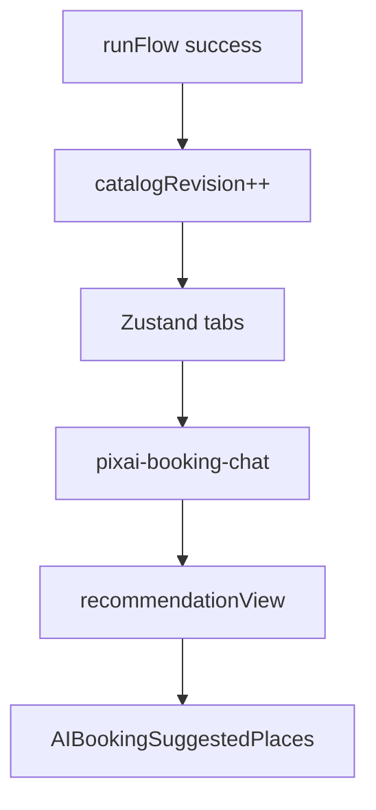

# AI Booking Chat — итоговый отчёт

## 1. Архитектура (кратко)

- **Feature**: [`src/features/ai-booking-chat`](src/features/ai-booking-chat) — изолированный модуль (типы, Zustand store, API-абстракция, UI).
- **Экран**: [`src/pages/ai-booking/ui/AIBookingPage.tsx`](src/pages/ai-booking/ui/AIBookingPage.tsx) — инкремент `catalogRevision` после успешного `runFlow`, вычисление `effectivePlaces`, точка монтирования [`BookingChatDock`](src/features/ai-booking-chat/ui/BookingChatPanel.tsx) на шаге `booking`.
- **Оркестратор PixAI** ([`usePixAI`](src/entities/pixai/api/usePixAI.ts)) не менялся: чат **не** пишет в `messages` оркестратора.

## 2. Поток состояния

1. Пользователь получает `placeOptions` из последнего `toolResult`.
2. `catalogRevision` увеличивается при каждом новом успешном поиске; [`bumpCatalogRevision`](src/features/ai-booking-chat/model/bookingChatStore.ts) сбрасывает per-tab `recommendationView`.
3. Активная вкладка хранит `messages` и `recommendationView` (id-only rerank/exclude).
4. [`buildEffectivePlaces`](src/features/ai-booking-chat/lib/buildEffectivePlaces.ts) строит список для UI из канонических объектов `PixAIPlace` + view.
5. При исключении текущего `selectedPlace` срабатывает `useEffect` на странице — сброс выбора и возврат к шагу `places`.

## 3. Gemini и Edge

- Функция: [`supabase/functions/pixai-booking-chat/index.ts`](supabase/functions/pixai-booking-chat/index.ts).
- Секрет: **`GEMINI_API_KEY`** в настройках проекта Supabase. Без ключа функция возвращает 200 с безопасным текстом и исходным порядком id (без вызова внешнего API).
- Клиент: [`invokePixaiBookingChatWithAuth`](src/features/ai-booking-chat/api/invokePixaiBookingChat.ts) + адаптер [`defaultBookingChatProvider`](src/features/ai-booking-chat/api/geminiBookingChatAdapter.ts).
- Валидация id на сервере: [`validateAndRepairShape`](supabase/functions/pixai-booking-chat/index.ts); на клиенте — [`sanitizeAiBookingChatResult`](src/features/ai-booking-chat/lib/sanitizeAiBookingChatResult.ts).

## 4. Адаптация рекомендаций

- Контракт ответа: `message`, `filters`, `rerankedPlaceIds`, `excludedPlaceIds`, опционально `explanation`.
- Список карточек: только из текущего `placeOptions`; дубликаты полных сущностей по вкладкам не хранятся.

## 5. Вкладки и сессии

- Создание / закрытие / переключение вкладок в store; при открытии панели — [`ensureActiveTab`](src/features/ai-booking-chat/model/bookingChatStore.ts).
- При уходе со шага `booking` панель закрывается ([`BookingChatDock`](src/features/ai-booking-chat/ui/BookingChatPanel.tsx)), история вкладок сохраняется в памяти до перезапуска приложения.

## 6. Производительность

- Селектор `recommendationView` через [`useShallow`](src/pages/ai-booking/ui/AIBookingPage.tsx).
- Сообщения: [`FlashList`](src/features/ai-booking-chat/ui/BookingChatPanel.tsx) + мемо-строка + стабильный `renderItem`.
- Чат не использует React Query для своего UI.

## 7. Ошибки и крайние случаи

- Сеть / invoke: сообщение ассистента в чате + `sendError` в store; список мест не ломается.
- Исключённое выбранное место: алерт и сброс на шаг мест.
- Пустой список мест: композер disabled.

## 8. Расширяемость

- Интерфейс [`AiBookingChatProvider`](src/features/ai-booking-chat/api/aiBookingChatProvider.ts) с опциональным `sendTurnStream` для будущего стрима.
- Смена провайдера: новый адаптер, реализующий `sendTurn`, без правок UI.

## 9. Известные ограничения

- Нет персистентности чатов на диске после kill приложения.
- Новые заведения вне последнего поиска чат не подгружает — нужен повторный «Search places».
- Модель и промпт на edge можно уточнять под продукт без смены клиентского контракта.

## 10. Валидация вручную

- Пройти PixAI Smart Booking до шага даты/слота, открыть FAB, отправить запрос, убедиться в изменении порядка карточек (при настроенном `GEMINI_API_KEY`).
- Проверить «Back step» с открытой панелью — панель закрывается.
- Создать бронь без открытия чата — регрессия основного потока.
